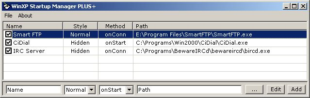



## WinXP Startup Plus

### Description

A simple listview program that'll start up programs on start or on active internet connection found.
 
### More Info
 

             |
---                |---
**Submitted On**   |2003-08-02 15:38:40
**By**             |[Graham Lee Compton](https://github.com/Planet-Source-Code/PSCIndex/blob/master/ByAuthor/graham-lee-compton.md)
**Level**          |Intermediate
**User Rating**    |5.0 (10 globes from 2 users)
**Compatibility**  |VB 6\.0
**Category**       |[Miscellaneous](https://github.com/Planet-Source-Code/PSCIndex/blob/master/ByCategory/miscellaneous__1-1.md)
**World**          |[Visual Basic](https://github.com/Planet-Source-Code/PSCIndex/blob/master/ByWorld/visual-basic.md)
**Archive File**   |[WinXP\_Star162693892003\.zip](https://github.com/Planet-Source-Code/graham-lee-compton-winxp-startup-plus__1-47525/archive/master.zip)

